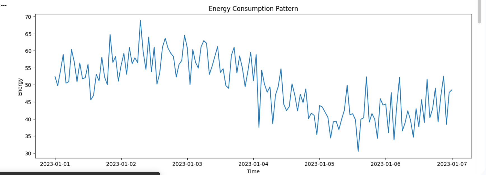
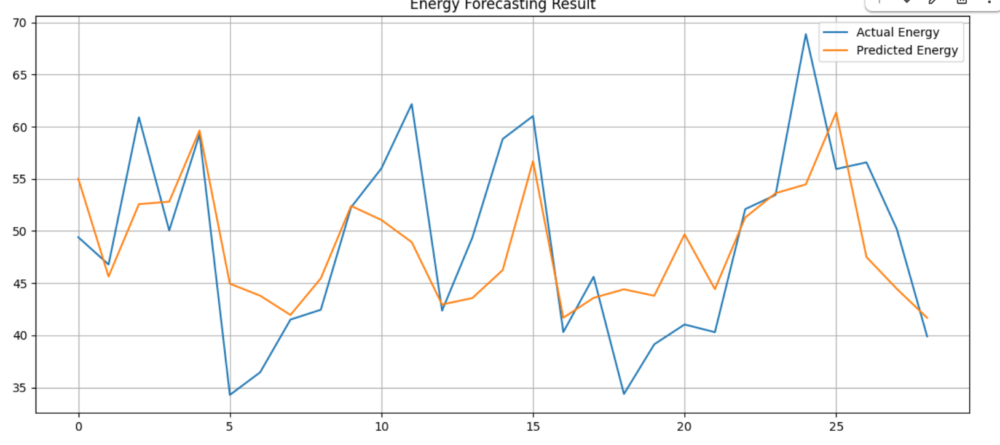
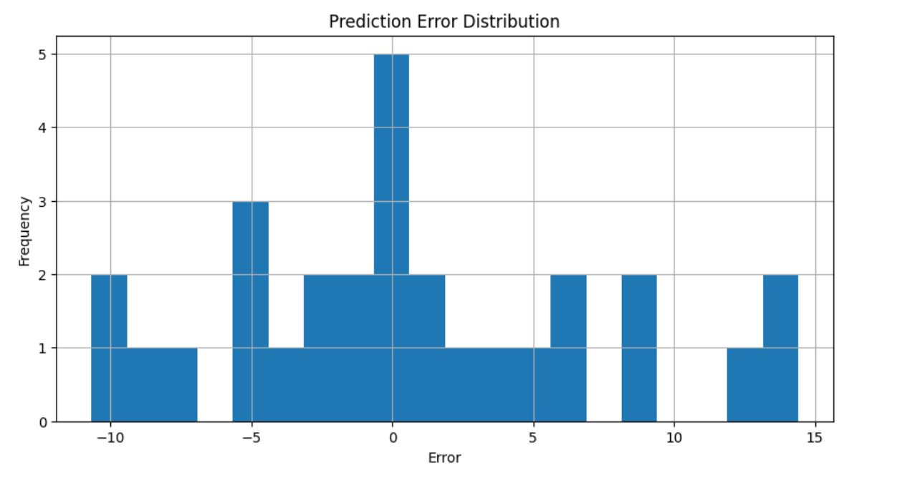
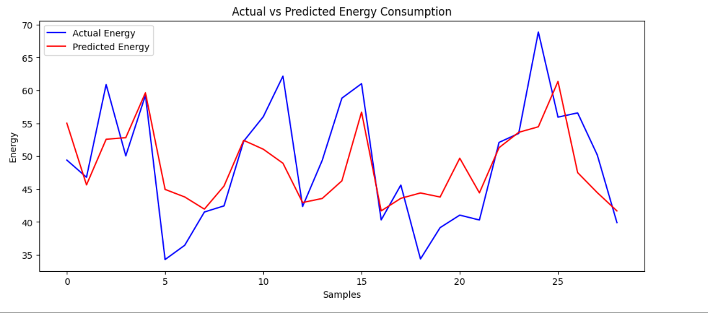

# ⚡ AI-POWERED ENERGY CONSUMPTION FORECASTING SYSTEM

[] [] []

## ⚡ SYSTEM OVERVIEW
This project is a Machine Learning-based Energy Consumption Forecasting System that predicts electricity usage using historical time-series data. It simulates real-world smart grid systems where AI helps in forecasting future energy demand to improve efficiency, reduce cost, and prevent energy wastage.

## 🔥 WHY THIS PROJECT EXISTS
Traditional energy systems fail to predict demand accurately, leading to power wastage, overproduction of electricity, high costs, and poor load balancing. This AI system solves this problem using machine learning forecasting.

## 🏗️ SYSTEM ARCHITECTURE
Data Collection → Data Cleaning → Feature Engineering (Hour, Day) → Train/Test Split → MLP Regressor Model → Training → Prediction → Evaluation (MAE, R²) → Visualization

## 📊 DATASET OVERVIEW
Time-series energy consumption dataset:
- Datetime
- Energy (kWh)

Feature Engineering:
- Hour of Day
- Day of Week

## ⚙️ INSTALLATION
git clone https://github.com/your-username/AI-Energy-Forecasting-System.git  
cd AI-Energy-Forecasting-System  
python -m venv venv  
venv\Scripts\activate  
source venv/bin/activate  
pip install -r requirements.txt  

## 🚀 USAGE
python main.py  

OR:
- Load dataset  
- Preprocess data  
- Train model  
- Predict output  
- Visualize graphs  

## ⚙️ TECH STACK
Python, Pandas, NumPy, Matplotlib, Scikit-learn, Joblib

## 📁 PROJECT STRUCTURE
```
AI-Energy-Forecasting-System/
├── data/
├── models/
├── images/
│   ├── graph1.png
│   ├── graph2.png
│   ├── graph3.png
├── notebooks/
├── src/
├── README.md
└── requirements.txt
```
## 📈 RESULTS
Model learns energy usage patterns and predicts future consumption with reasonable accuracy using MAE and R² evaluation.

---

## 📸 OUTPUT VISUALIZATION

<p align="center">

</p>

<p align="center">

</p>

<p align="center">

</p>

<p align="center">

</p>
---

## 🌐 CONNECT WITH ME

<a href="https://github.com/your-username">

</a>

<a href="https://www.linkedin.com/in/your-link">

</a>

<a href="https://www.instagram.com/your-instagram">

</a>

<a href="https://your-portfolio-link.com">

</a>

---

## 👨‍💻 AUTHOR
Mahesh Bhakre

## ⭐ NOTE
This project demonstrates an AI-based energy forecasting system for smart grids and real-world energy optimization.
